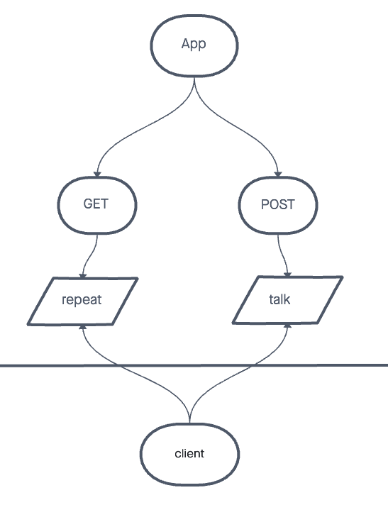

# Express Server

Created by Jacob Knaack

## Links to application deployment

* Heroku Applications
  * prod: https://evan-server-deploy-prod.herokuapp.com/repeat
  * dev: https://evan-server-deploy-dev.herokuapp.com/repeat
* Github
  * Actions: https://github.com/evan-woodworth/server-deployment-practice/actions
  * Pull Request: https://github.com/evan-woodworth/server-deployment-practice/pull/1

## Include embedded UML

## Routes

* HTTP GET
  * Path: /repeat
    * responds with the last string used in post route `/talk`.

* HTTP POST
  * Path: /talk
    * Accepts a string.
    * responds with a string in all caps.